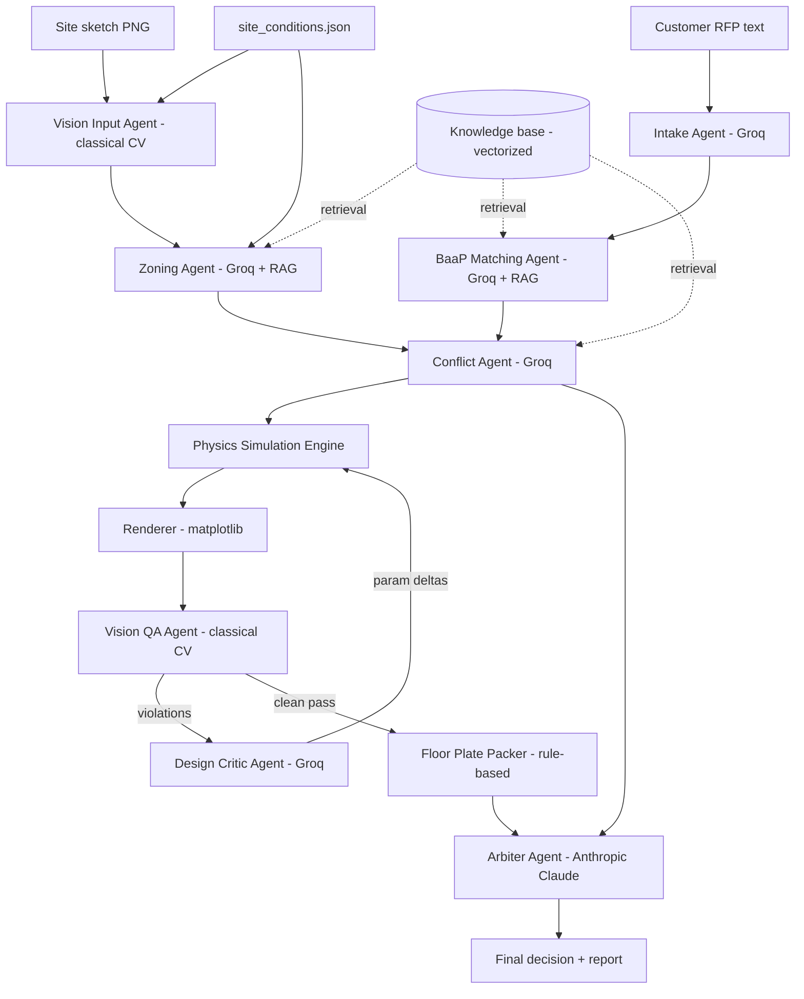

# RNGD Concept-to-Schematic Multi-Agent Harness — Build Report

## 1. What this is

A working proof-of-concept multi-agent AI pipeline for RNGD's "concept-to-schematic"
problem: turn an unstructured customer request plus raw site conditions into a
Building-as-a-Product (BaaP) schematic — a site plan, a floor plate, a written
compliance narrative, and one defensible final decision — automatically, with
every intermediate step inspectable.

It is built entirely against **synthetic sample data** (a fictional jurisdiction,
a fictional BaaP module catalog, one fictional project) because RNGD has not yet
provided real customer programs, site surveys, zoning sources, or BaaP catalog
data (these are literally the open questions in
`RNGDTeamPreparationQuestions.pdf`). Every file under `data/` is clearly marked
synthetic, and swapping in RNGD's real data requires no code changes — only new
files in the same shape.

## 2. Architecture



The **ProjectState** object is a shared blackboard: every agent reads what it
needs from it and writes its result back, and every call is wrapped in a
`traced_call()` context manager that times it, catches failures without
killing the whole run, and appends a structured trace entry — this is the
"harness" layer, visible in the Streamlit app's Agent Trace tab.

## 3. Where each requested piece lives

| Requirement | Implementation |
|---|---|
| Inputs, docs, files | `data/` — RFP text, site JSON, site sketch PNG, BaaP catalog (md + JSON), zoning code (md) |
| Vector database | `src/rngd/vectorstore.py` — in-memory semantic index (sentence-transformers, TF-IDF fallback) over the knowledge base, queried by every text agent via retrieval-augmented generation |
| Visual/vision models | Classical computer vision, not a vision LLM (see §4) — `src/rngd/vision/site_sketch_parser.py` (reads the input sketch) and `layout_qa.py` (re-measures the generated site plan) |
| "Physics-style simulation engine" | `src/rngd/simulation/physics_engine.py` — 2D rigid-body relaxation (containment + separation forces, damped integration) that packs the building footprint, driveway, and parking into the buildable envelope |
| Multi-agent rule-checks, optimization, decisions | Conflict Agent (quantitative feasibility), Vision QA (geometric re-measurement), Design Critic (closes the sim/CV loop), Arbiter (final decision) |
| Reserve Anthropic for the hardest step only | Every agent runs on Groq except `agents/arbiter_agent.py`, the single Claude call per pipeline run |

## 4. Key design decision: no vision LLM, classical CV instead

The plan going in was to use a Groq vision-capable model to "look at" the
drawings. Once building started, `client.models.list()` against the
`GROQ_API_KEY` in `.env` showed this account only exposes text models
(`openai/gpt-oss-120b/20b`, `qwen/qwen3.8-27b`, `groq/compound`, Whisper) — no
`llama-*-vision` or similar. Rather than block on that, the design pivoted to
**classical computer vision**: color segmentation, connected-component
counting, and a calibrated pixel-to-feet transform (`vision/site_sketch_parser.py`,
`vision/layout_qa.py`). This is arguably better suited to this specific job
than a vision LLM would be — measuring a setback distance or counting parking
stalls is a precise geometric question, not a captioning one, and classical CV
gives exact, reproducible numbers instead of an LLM's approximate read of an
image. If the Groq account later gets vision access, it's a natural add-on
(a `vision_groq.py` alongside `llm_groq.py`) for tasks classical CV can't do,
like reading an arbitrary uploaded floor plan PDF.

## 5. Walking through the sample run

Run `python src/run_pipeline.py` and here's what happens, agent by agent, for
the one sample project (a 120-unit, 4-story multifamily request on a 200'x300'
lot with a 20' utility easement):

1. **Vision input agent** reads `site_sketch.png` (a synthetic scanned-survey
   stand-in) via color segmentation + a georeference sidecar, and cross-checks
   the measured lot/easement geometry against `site_conditions.json`. Confirms
   consistency (or would flag a discrepancy if the drawing and the spec sheet
   disagreed — a real and common AEC handoff problem).
2. **Intake agent** (Groq) parses the free-text customer RFP into a structured
   program: 120 units (flagged **hard**), a 20/45/35 studio/1BR/2BR mix,
   4 floors, amenities, a stated preference for surface parking, budget, and
   schedule — with everything not explicitly marked "firm" correctly filed as
   soft or as an assumption.
3. **Zoning agent** (Groq + RAG) retrieves the applicable sample zoning
   sections and computes the buildable envelope in plain Python (never left to
   an LLM): 170' x 265' = 45,050 sf, after setbacks and the easement.
4. **BaaP matching agent** (Groq + RAG) converts the unit mix into exact BaaP
   module counts (24 studio / 54 1BR / 42 2BR modules), computes GSF via the
   catalog's grossing factor, and writes an adjacency plan grounded in the
   retrieved stacking rules.
5. **Conflict agent** (Groq) computes, in Python, that 150 stalls are required
   at the code's 1.25/unit ratio, that surface parking for 150 stalls needs
   roughly 49,500 sf, and that only ~17,000 sf is left after the building
   footprint — then reasons about severity and flags this **critical**.
6. **Physics simulation** places the building, a driveway, and as many parking
   stalls as geometrically fit, using force-based separation/containment —
   converges in 6 steps once a real sign bug was fixed (see §6).
7. **Vision QA agent** re-measures the *rendered PNG* independently: zero
   setback/easement/overlap violations, 46.3% lot coverage, but only 15 of the
   150 required stalls physically fit.
8. **Design critic agent** (Groq) correctly concludes a 135-stall shortfall is
   a program/site conflict, not something another simulation pass can fix, and
   stops the iteration loop rather than spinning uselessly.
9. **Floor plate packer** (rule-based, not physics) lays out a mixed-unit
   double-loaded corridor for a typical upper floor and a ground floor with
   lobby/fitness/back-of-house, following the interleave-by-ratio + core/MEP
   alignment rules.
10. **Arbiter (Anthropic Claude, one call)** synthesizes all of the above into
    a final decision: **REVISE**, ~93% confidence, with a specific narrative,
    unresolved issues, and next steps (structured/podium parking, a variance
    request, or a program change) — explicitly refusing to approve a design
    with an unresolved critical conflict, and explicitly noting the output is
    prototype-stage and needs licensed professional review.

This is a good outcome for a demo: the system didn't rubber-stamp a design, it
found a real, quantified, defensible reason the requested program doesn't fit
the site as specified — exactly the kind of early conflict-screening RNGD's
own problem statement asks for.

## 6. Bugs found and fixed while building (worth knowing about)

Building this surfaced several real bugs, fixed and verified by rerunning the
full pipeline after each:

- **Physics engine sign error**: the separation-force direction was inverted,
  pushing overlapping bodies *together* instead of apart, causing the
  simulation to diverge (the building drifted to -2 ft, penalty plateaued at
  36). Fixed the sign in `_separation_force`; the same scenario now converges
  in 6 steps.
- **Renderer/CV DPI mismatch**: `_save_geom_sidecar` read `fig.dpi` (default
  100) while `savefig` wrote the PNG at 140 dpi, silently scaling every
  CV-measured coordinate by 1.4x. Fixed by setting dpi at figure-creation time
  so the calibration and the raster always agree — a good example of why the
  CV QA step re-measures the *actual rendered artifact* rather than trusting
  the geometry objects that drew it.
- **Floor plate corridor orientation**: the packer ran the double-loaded
  corridor along the buildable envelope's *shorter* axis (170') instead of the
  longer one (265'), so most units had nowhere to go and were silently
  deferred. Also, a naive "widest-first" sort filled entire rows with 2BR
  units before any studio/1BR got a turn. Fixed by packing along the longer
  axis and replacing the sort with a proportional interleave (still biasing
  the two largest units toward each row's ends, just not to the exclusion of
  everything else).
- **An ambiguous CV field name, caught by the Arbiter itself**: the CV QA
  schema originally had a single `passed` boolean that ignored parking
  shortfall by design (a shortfall is meant to be a conflict, not a geometry
  defect) — but on a real run, the Anthropic arbiter read `passed: true` next
  to a 135-stall shortfall and correctly called this out as an internal
  inconsistency in the QA gating logic. That's a genuinely good outcome (the
  most expensive, most careful agent in the system caught a design flaw
  upstream of it), but it also meant the schema was actually unclear, so it
  was split into `geometry_passed` (setbacks/easements/overlaps only) and a
  separate `parking_shortfall` count, with the Arbiter's system prompt now
  explaining the distinction explicitly.

## 7. Mapping back to RNGD's kickoff questions

This prototype takes a position on several of the open questions in
`RNGDTeamPreparationQuestions.pdf`, pending RNGD's actual answers:

- **Q46-49 (what "schematic design" means)**: this prototype produces a site
  plan + a ground floor + a typical upper floor, matching the doc's own
  suggestion that a ground-floor/typical-floor scope is an acceptable
  semester target rather than every floor of a multistory building.
- **Q50-52 (output format)**: output is a graphical PNG/PDF-style plan plus
  structured JSON (`project_state.json`), not a Revit/IFC file — consistent
  with the doc's framing that structured geometry convertible to Revit later
  is acceptable for this stage.
- **Q53 (written report)**: yes — the Arbiter's narrative plus the full
  conflict list *is* that report, generated automatically per run.
- **Q60 ("insufficient information")**: implemented directly — the Conflict
  Agent and Arbiter are instructed to say so explicitly rather than fabricate
  a compliant-looking number, and the sample run demonstrates exactly that
  behavior on the parking constraint.
- **Q24-27, Q33-38 (real codes / real BaaP source of truth)**: still open —
  this prototype's zoning and BaaP data are clearly-labeled placeholders.
  Swapping them for RNGD's real sources is a data change, not an architecture
  change.

## 8. Known limitations / natural Phase 2 items

- Floor plate packing is a single double-loaded corridor spine; a real
  building might need multiple wings or a different core count for larger
  floor plates — the packer would need an L/U-shape mode.
- The physics simulation only moves the building body; parking and driveway
  placement are deterministic given the envelope. A richer simulation could
  also let parking configuration vary (e.g., double-row vs. single-row) as
  part of the relaxation.
- No real zoning/BaaP data source is connected yet — this is explicitly
  waiting on RNGD.
- The vision input/QA agents are classical CV, tuned to this project's
  rendering palette; a real scanned survey or an arbitrary customer-supplied
  drawing would need either a more general CV pipeline or (once available) a
  vision-capable LLM.
- No persistence across runs beyond the `outputs/<project_id>/` folder; no
  multi-project comparison UI.

## 9. How to demo

```bash
pip install -r requirements.txt
python src/make_sample_data.py      # once, generates the sample site sketch
python src/run_pipeline.py          # CLI: full trace + final decision printed
streamlit run src/app.py            # interactive: trace, images, conflicts,
                                     # convergence chart, and a free-form
                                     # "ask any agent" panel over the KB + state
```

The Streamlit app has 8 tabs: Overview, Agent trace, Program & site, BaaP plan
& conflicts, Site simulation (with the physics convergence chart), Floor
plates, Final decision, and Ask an agent (on-demand querying of any agent's
domain against the knowledge base and current project state, not locked to
the fixed pipeline order).
